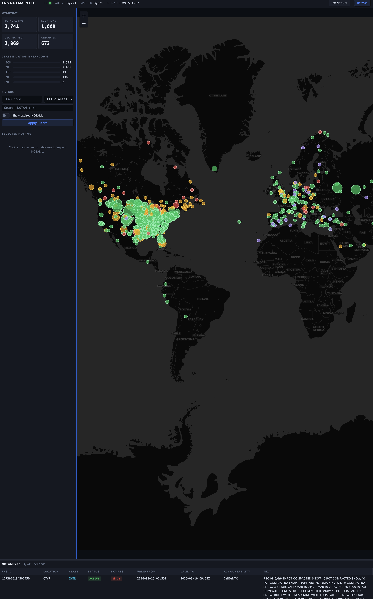

# FNS NOTAM Client

> **A [JS Labs](https://labs.jamessawyer.co.uk/) Prototype**
>
> This is an independent experimental project by James Sawyer.
> It is not production software. No warranties of any kind are given.

---

## IMPORTANT LEGAL NOTICE

### 1. No government affiliation

This project is **not** an official product of, endorsed by, affiliated with, or in any way associated with:

- The United States Government
- The Federal Aviation Administration (FAA)
- The Department of Transportation (DOT)
- The SWIM Program Office
- Solace Corporation
- Any other government agency, contractor, or data provider

"FAA", "SWIM", "FNS", and "NOTAM" are used here solely to describe the public data source this client connects to. All trademarks belong to their respective owners.

### 2. No warranty

THIS SOFTWARE IS PROVIDED "AS IS", WITHOUT WARRANTY OF ANY KIND, EXPRESS OR IMPLIED, INCLUDING BUT NOT LIMITED TO THE WARRANTIES OF MERCHANTABILITY, FITNESS FOR A PARTICULAR PURPOSE, AND NON-INFRINGEMENT.

IN NO EVENT SHALL THE AUTHOR OR COPYRIGHT HOLDER BE LIABLE FOR ANY DIRECT, INDIRECT, INCIDENTAL, SPECIAL, EXEMPLARY, OR CONSEQUENTIAL DAMAGES (INCLUDING BUT NOT LIMITED TO PROCUREMENT OF SUBSTITUTE GOODS OR SERVICES, LOSS OF USE, DATA, OR PROFITS, OR BUSINESS INTERRUPTION) HOWEVER CAUSED AND ON ANY THEORY OF LIABILITY, WHETHER IN CONTRACT, STRICT LIABILITY, OR TORT (INCLUDING NEGLIGENCE OR OTHERWISE) ARISING IN ANY WAY OUT OF THE USE OF THIS SOFTWARE, EVEN IF ADVISED OF THE POSSIBILITY OF SUCH DAMAGE.

### 3. Not for operational use

**DO NOT USE THIS SOFTWARE FOR OPERATIONAL AVIATION DECISIONS.**

NOTAM data displayed by this client may be incomplete, delayed, stale, or incorrect. This client is an independent consumer of publicly available SWIM data and has no guarantee of data freshness, completeness, or accuracy. Always consult official FAA sources (https://notams.aim.faa.gov/) for flight-critical information.

### 4. Prototype status

This is a **JS Labs prototype** built for personal learning and experimentation. It is not production-grade software. It has not been audited, certified, or validated for any operational, commercial, or safety-critical purpose. Use entirely at your own risk.

---

## Why This Exists

The FAA publishes live NOTAM data through its SWIM (System Wide Information Management) program. The official reference client is a Java desktop application designed for Windows and Linux. It works, but:

- It requires a local Java runtime and Solace JMS libraries.
- It has no browser-based UI, no map view, and no REST API.
- Running it on macOS means wrestling with cross-platform Java tooling that has not been updated for modern workflows.

This project is a **ground-up Python reimplementation** of that reference client, purpose-built for:

- **macOS and Docker** -- no JVM, no cross-platform Java hassle.
- **A browser-based NOC-style dashboard** with live map, NOTAM table, filtering, CSV export, and urgency countdowns.
- **A clean REST API** so downstream tools can query NOTAM data programmatically.
- **Deterministic replay mode** for local development and demos without live SWIM credentials.
- **Modern Python** (3.11+) with FastAPI, SQLAlchemy, and a minimal container footprint.

This is a prototype for personal use and experimentation. It is not intended to replace or compete with any official FAA tooling.

---

## Screenshots

### Dashboard -- live NOTAM map with 3,700+ active NOTAMs



*Dark-theme NOC-style interface showing the world map with urgency-coloured NOTAM markers, classification breakdown, filters, and live NOTAM feed table.*

---

## Author

**James Sawyer**
[https://labs.jamessawyer.co.uk/](https://labs.jamessawyer.co.uk/) | [https://github.com/tg12](https://github.com/tg12)

---

## Overview

This repository runs as a native Python client with one operator workflow:

1. Copy `src/main/resources/fnsClient.conf.example` to `src/main/resources/fnsClient.conf` and fill in your SWIM credentials.
2. Start the stack with `./run_local_stack.sh`.
3. Open `http://localhost:8080`.

The service supports two modes through the config file:

- `runtime.mode="replay"` for deterministic local startup using bundled XML.
- `runtime.mode="live"` for real SWIM JMS and FIL ingestion using the credentials you place in `fnsClient.conf`.

If FIL is not configured yet, live mode starts in JMS-only mode so the service can still come up and ingest new traffic.

## Configuration

All operator-editable settings are in `src/main/resources/fnsClient.conf`.

A template with placeholder values is provided at `src/main/resources/fnsClient.conf.example`. Copy it and fill in your SWIM credentials:

```bash
cp src/main/resources/fnsClient.conf.example src/main/resources/fnsClient.conf
```

Important fields:

- `runtime.mode`
- `runtime.replayPath`
- `jms.enabled`
- `jms.providerUrl`
- `jms.username`
- `jms.password`
- `jms.solace.messageVpn`
- `jms.connectionFactory`
- `jms.destination`
- `fil.sftp.host`
- `fil.sftp.username`
- `fil.sftp.certFilePath`
- `notamDb.connectionUrl`

**Never commit `fnsClient.conf` to version control.** It is gitignored by default. The example template is safe to commit.

FIL private key requirement:

```bash
ssh-keygen -p -N "" -m pem -f /path/to/key
```

Mount the converted PEM file under `./secrets/` and point `fil.sftp.certFilePath` at that container path.

## Local Stack

Start everything locally:

```bash
./run_local_stack.sh
```

Included services:

- Native Python FNS client
- PostgreSQL backing store
- Browser UI served by the Python API
- Replay XML sample data for deterministic local startup

## Browser UI

Open:

```text
http://localhost:8080
```

Available features:

- Status dashboard with live KPIs
- Interactive dark-theme NOTAM map with urgency-coloured markers
- Location designator filtering
- Classification filtering
- Full-text NOTAM search
- CSV export
- Health endpoint for diagnostics

## API

JSON endpoints:

- `GET /api/status`
- `GET /api/notams`
- `GET /health`

Legacy compatibility endpoints:

- `GET /locationDesignator/{id}`
- `GET /classification/{classification}`
- `GET /delta/{YYYY-mm-DD HH:MM:SS}`
- `GET /timerange/{YYYY-mm-DD HH:MM:SS}/{YYYY-mm-DD HH:MM:SS}`
- `GET /allNotams`
- `GET /notamTable/{id}`

## Requirements

- macOS (primary target) or any Docker-capable host
- Docker Desktop
- Python 3.11+ (for local development outside Docker)

## Testing

```bash
python3 -m pytest -q
```

## License

Apache 2.0. See [LICENSE](LICENSE) for details.

---

## Changelog

### v2.0.0 -- Python rewrite (2026-03-16)

Complete ground-up reimplementation. The original Java/Maven reference client has been replaced with a native Python stack.

#### What changed from the original Java version

**Removed:**
- All Java source code (`src/main/java/us/dot/faa/swim/fns/`)
- Maven build system (`pom.xml`)
- Git submodules (`aixm-5.1`, `swim-utilities`, `jms-client`)
- FnsClient Diagram image
- `.gitmodules`

**Added -- Python service (`fns_client/`):**
- `config.py` -- loads the existing `fnsClient.conf` format, no config migration needed
- `transport.py` -- Solace JCSMP/JMS consumer reimplemented on `solace-pubsubplus`
- `fil.py` -- FIL SFTP poller reimplemented on `paramiko`
- `parser.py` -- AIXM XML-to-dict NOTAM parser using `xmltodict`
- `messages.py` -- message dispatch and deduplication
- `database.py` -- PostgreSQL NOTAM store using SQLAlchemy + `psycopg`
- `missed_tracker.py` -- stale/missed message detection
- `determinism.py` -- centralized seed management for replay mode
- `rest_api.py` -- FastAPI REST API with JSON and legacy-compatible endpoints
- `service.py` -- top-level service orchestrator
- `logging_utils.py` -- coloured structured logging via `colorlog`

**Added -- browser UI (`public/index.html`):**
- Dark-theme NOC-style single-page dashboard
- Live Leaflet map with ~60,000 ICAO airport locations + FIR/ARTCC lookups
- Urgency-coloured markers (critical/warning/ok/permanent)
- NOTAM table sorted by expiry with live countdown badges
- Sidebar with KPIs, classification breakdown bars, and detail panel
- ICAO code, classification, and full-text search filters
- Show/hide expired NOTAMs toggle
- CSV export
- Resizable table panel

**Added -- infrastructure:**
- `Dockerfile` -- Python 3.14-slim container
- `docker-compose.yml` -- two-service stack (app + PostgreSQL 18)
- `run_local_stack.sh` -- single-command local startup
- `pyproject.toml` -- modern Python packaging with ruff linting config
- `requirements.txt` / `requirements-stable.txt`
- `tests/` -- pytest suite for config, database, messages, and service
- `src/main/resources/fnsClient.conf.example` -- safe credential-free template

**Added -- production readiness:**
- Comprehensive `.gitignore` covering Python, Docker data, secrets, IDE files
- Credential file (`fnsClient.conf`) removed from git tracking
- `START_HERE.txt` gitignored (contains operator-specific credentials)
- `secrets/` directory gitignored
- README with full disclaimer, author attribution, and JS Labs branding

**Changed -- map stability:**
- Incremental marker updates instead of clear-and-rebuild on every refresh
- Replaced `flyTo` animation with `setView` for predictable panning
- Integer zoom steps instead of half-zoom (no more jitter)
- Tighter world bounds with inertia damping (no erratic edge-jumping)

---

*JS Labs Prototype by [James Sawyer](https://labs.jamessawyer.co.uk/) -- provided "as is" with no warranties of any kind. Not for operational aviation use.*

